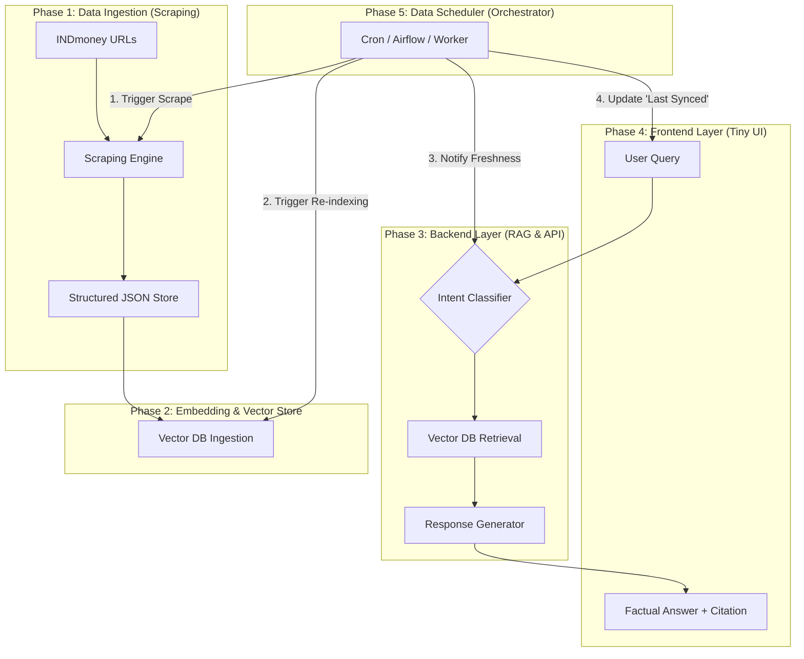

# Project Architecture: INDmoney Factual MF Assistant

This folder contains the architectural design and data flow diagrams for the INDmoney RAG Chatbot. 

## 1. High-Level System Architecture
The project is divided into 4 key phases to ensure modularity, data freshness, and security.

## 2. Phase-wise Breakdown

### Phase 1: Data Ingestion (Scraping)
*   **Purpose**: To fetch raw mutual fund data from INDmoney.
*   **Folder**: `phase1/`
*   **Key Files**: `phase1/scraper.py`, `phase1/fund_data.json`.
*   **Outcome**: A structured `fund_data.json` based on user-provided fund details.

### Phase 2: Embedding & Vector Store
*   **Purpose**: To generate vector embeddings and store them for semantic search.
*   **Folder**: `phase2/`
*   **Key Files**: `phase2/ingest.py`.
*   **Outcome**: A searchable `chroma_db/` vector store.

### Phase 3: Backend Services (RAG & API)
*   **Purpose**: To process user queries using Retrieval-Augmented Generation.
*   **Folder**: `phase3/`
*   **Key Files**: `phase3/main.py`, `phase3/bot.py`.

### Phase 4: Frontend Development (Tiny UI)
*   **Purpose**: To provide a clean, premium interface for end-users.
*   **Folder**: `phase4/`
*   **Key Files**: `phase4/index.html`.

### Phase 5: Data Scheduler (The Orchestrator)
*   **Purpose**: To automate the data update cycle at the very end of the architectural flow.
*   **Folder**: `phase5/`
*   **Key Files**: `phase5/scheduler.py`.
*   **Logic**: Triggers Ph1 -> Ph2 -> Ph3 (Backend notification) -> Ph4 (Frontend status).

## 3. Data Flow
1.  **User** sends a query via the **UI**.
2.  **Frontend** sends the query to the **FastAPI Backend**.
3.  **Backend** classifies the intent (Factual vs. Advice).
4.  If **Factual**, the bot retrieves the relevant chunk from **ChromaDB**.
5.  **LLM** (simulated) generates a concise answer with the **INDmoney Citation**.
6.  **User** receives the factual response.

---
*For a detailed implementation plan, refer to the [implementation_plan.md](file:///Users/ferozkhan/.gemini/antigravity/brain/0857546e-f961-4620-a5a5-ed113f3ecfb6/implementation_plan.md) artifact.*
